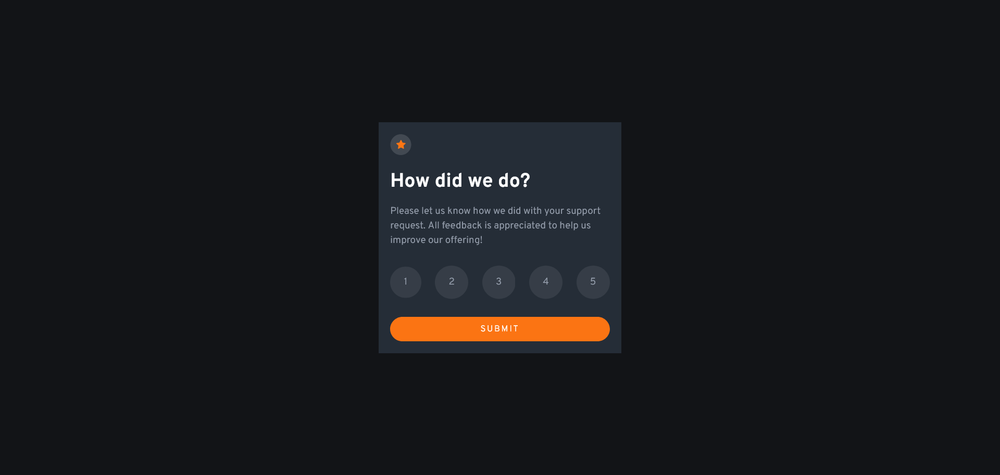

# Frontend Mentor - Interactive rating component solution

This is a solution to the [Interactive rating component challenge on Frontend Mentor](https://www.frontendmentor.io/challenges/interactive-rating-component-koxpeBUmI). Frontend Mentor challenges help you improve your coding skills by building realistic projects. 

## Table of contents

- [Overview](#overview)
  - [The challenge](#the-challenge)
  - [Screenshot](#screenshot)
  - [Links](#links)
- [My process](#my-process)
  - [Built with](#built-with)
  - [What I learned](#what-i-learned)
  - [Useful resources](#useful-resources)
- [Author](#author)
- [Acknowledgments](#acknowledgments)

## Overview

### The challenge

Users should be able to:

- View the optimal layout for the app depending on their device's screen size
- See hover states for all interactive elements on the page
- Select and submit a number rating
- See the "Thank you" card state after submitting a rating

### Screenshot




### Links

- Solution URL: [Solution github](https://github.com/efosu/interactive-rating-component)
- Live Site URL: [Live Preview](https://efosu.github.io/interactive-rating-component/)

## My process

### Built with

- Semantic HTML5 markup
- CSS custom properties
- Flexbox
- CSS Grid


### What I learned

Can use the input radio type element
to help style the rating button with the `has::` and `not::` psuedoelement clases
 ```html
<label for="two">
          2
  <input type="radio" name="rate" id="two" value="2" >
</label>
```
```css


[role='form']:not(#\#) form label:not(input:checked):hover {
    color: white;
    background-color: hsl(217, 12%, 63%);
    background-color: var(--light-gray-clr);
      cursor: pointer;
}


[role='form']:not(#\#) form label:has(input:checked){
  background-color: hsl(25, 97%, 53%) !important;
  background-color: var(--orange-clr) !important;
  color: white!important;
}

```

### Useful resources

- [Example resource 1](https://www.sitepoint.com/css-is-where-has-pseudo-class-selectors/)- This really helped me to style the button with css only.o


## Author


- Frontend Mentor - [@efosu](https://www.frontendmentor.io/profile/efosu)


## Acknowledgments
Thanks the frontend mentor team for providing these challenges to help us test and learn more about frontend.
